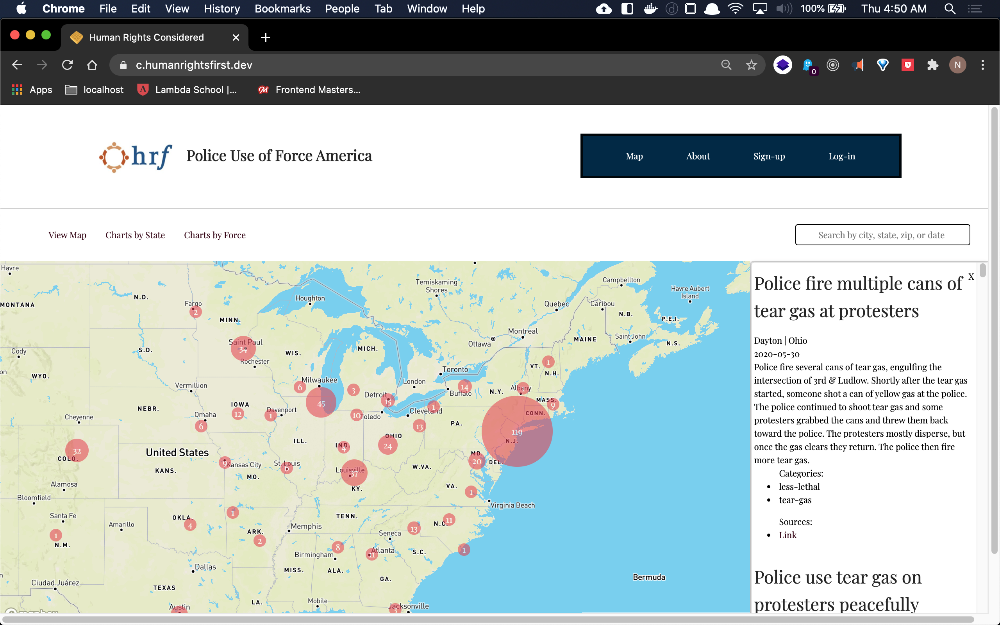
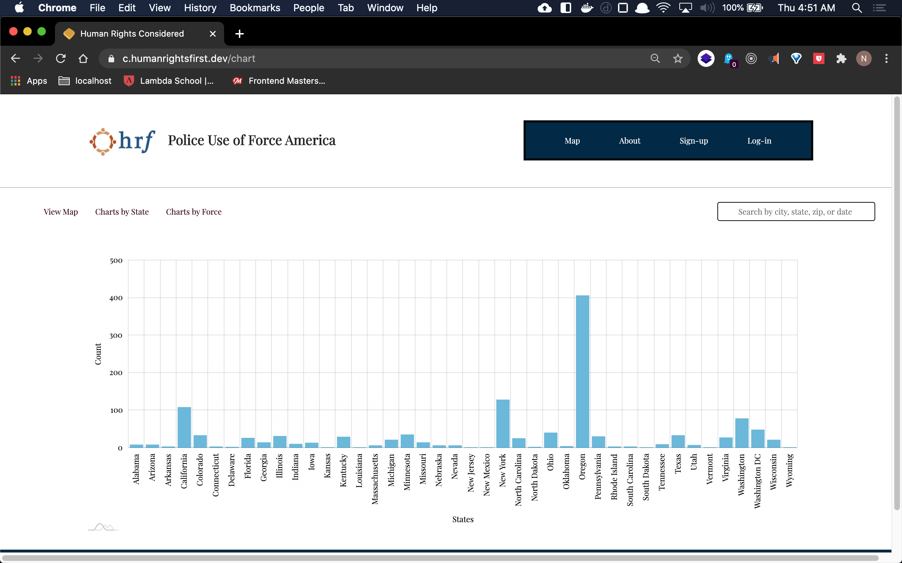
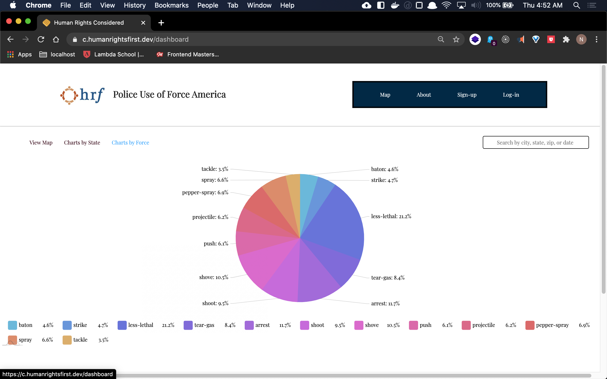

# How to Clusterize Data Points on a MAPBOX GL Map in React

There is too much fluff surrounding the facts when there are incidents of American police use-of-force reported in the news. Sometimes it is hard to find sources spread across varying platforms and other times opinions about the incident muddy the reporting. [Human Rights First](https://www.humanrightsfirst.org/about) is a non-profit organization hopes to provide unbiased information in an accurate and timely manner to concerned citizens and journalists alike. This is why they commissioned Lambda School students to scrape data reported across the web, classify it using the National Institue of Justice's [Use-of-Force Continuum](https://nij.ojp.gov/topics/articles/use-force-continuum) and display unbiased and easy to understand data visualizations.

One of the most important features for this project is an interactive map. Unfortunately, the amount of data we had was large and as it keeps growing, the performance of the map suffers. Tackling this problem was a big concern for the team. We assumed clustering the data points would help, but it was not something I had done before.

This clusterized map feature started from a user story similar to:

> “As a user, I can see clusters of incidents on a map that breaks apart as I scroll in so that I can see more specifically where each incident in the cluster occurred.”

This story was tangentially related to another that included a user being able to click on a data point and view more details.

The map user story was then broken down into individual tasks that included rendering a map on the screen, rendering data points on a map, and finding a way to cluster data points together. We knew there would be more involved, but this gave us a good point to begin our research for a solution.

---

## How [Supercluster](https://github.com/mapbox/supercluster) and [Use-Supercluster](https://www.npmjs.com/package/use-supercluster) Saved the Day

As we began to think about clustering data points on a map, it was obvious to us we were not the first developers to be tasked with solving this problem. A little time spent with our good friend Google led us to a plethora of like-minded problem-solvers. Now we just needed to find a solution that used the same technology as our inherited project, specifically working with Mapbox GL and the react-map-gl library.

Luckily for us, [Leigh Halliday](https://www.leighhalliday.com/), a popular developer who has a knack for teaching, has a few [videos](https://www.youtube.com/leighhalliday) and [blog posts](https://www.leighhalliday.com/mapbox-clustering) explaining how he solved this particular problem. He even created a package, [use-supercluster](https://www.npmjs.com/package/use-supercluster), to help us do this.

### Setting Up Our Mapbox Component

The project was already using Mapbox in React through [react-map-gl](https://www.npmjs.com/package/react-map-gl) so some of the initial work was done for us. The Mapbox required viewport and optional settings were already handled in state, and we were using a mapRef so that we had access to the bounding box of the map.

```javascript
import ReactMapGL from "react-map-gl";

function MapView() {
  const maxZoom = 17;

  // setup map state, settings, and mapRef
  const [viewport, setViewport] = React.useState({
    latitude: 41.850033,
    longitude: -97.6500523,
    zoom: 2.75,
  });
  const [settings, setSettings] = React.useState({
    dragRotate: false,
    scrollZoom: true,
    touchZoom: false,
    touchRotate: false,
    keyboard: false,
    doubleClickZoom: false,
  });

  const mapRef = React.useRef();
}

return (
  <div>
    <ReactMapGL
      {...viewport}
      {...settings}
      maxZoom={maxZoom}
      minZoom={2.75}
      width={"fit"}
      height={"70vh"}
      mapboxApiAccessToken={process.env.REACT_APP_MAPBOX_TOKEN}
      mapStyle='mapbox://styles/mapbox/streets-v11'
      onViewportChange={(newViewport) => {
        setViewport({ ...newViewport });
      }}
      ref={mapRef}
    ></ReactMapGL>
  </div>
);
```

Next, we needed to get the data ready to be _clusterized_.

### Prepare the Data

Supercluster expects us to produce an array of [GeoJSON Feature](https://geojson.org/) objects. These feature objects must also contain a geometry object that is a GeoJSON point with coordinates. While Leigh Halliday uses [SWR]() in his tutorials, our team had decided to use [react-query]() to handle the fetching of our server data. This is not necessary, but allows for continued expansion in UX down the road.

```javascript
// load incident data
const incidentsQuery = useIncidents();
const incidents =
  incidentsQuery.data && !incidentsQuery.isError ? incidentsQuery.data : [];
// incidents without a latitude and longitude we do not want to display on the map
const incidentsHaveLatLong = incidents.filter(
  (incident) => incident.lat !== 0 && incident.long !== 0
);
```

Once we had our data points in an `incidentsHaveLatLong` variable, we mapped through and created the necessary feature object for each and stored this in a `points` variable. Notice we are saving data we may want access to later in the `properties` object. We will see how that comes into play coming up.

```javascript
const points = incidentsHaveLatLong.map((incident) => {
  return {
    type: "Feature",
    properties: {
      incident: incident,
      cluster: false,
      incident_id: incident.incident_id,
    },
    geometry: {
      type: "Point",
      coordinates: [incident.long, incident.lat],
    },
  };
});
```

We then used the `mapRef.current` property to access the map `bounds` so that we could pass that to our clusters.

```javascript
const bounds = mapRef.current
  ? mapRef.current.getMap().getBounds().toArray().flat()
  : null;
```

### Fetch Clusters using Use-Supercluster

Leigh Halliday explains this part best, so here are his own words about the next step:

> With our points in the correct order, and with the bounds and zoom accessible, it's time to retrieve the clusters. This will use the useSupercluster hook provided by the use-supercluster package.
> It returns you through a destructured object an array of clusters and, if you need it, the supercluster instance variable.

We had to play around with the `radius` and `maxZoom` to get the map to display to our liking, and your team will likely do the same. Leigh Halliday also displays a marker for a single data point, but our team decided an individual data point with still be represented as a cluster. This keeps the UI consistent throughout the map.

```javascript
const { clusters, supercluster } = useSupercluster({
  points: points,
  zoom: viewport.zoom,
  bounds: bounds,
  options: {
    minPoints: 1,
    radius: 40,
    maxZoom: 20,
  },
});
```

### Map Through the Clusters and Display on the Map

This next section assumes some knowledge about how react-map-gl works. Now that we have the clusters, we need to add them onto the map as a `Marker` component which we import from `react-map-gl`

```javascript
<ReactMapGL
  ...
>
  {clusters.map((cluster) => {
    const [longitude, latitude] = cluster.geometry.coordinates;
    const { cluster: isCluster, point_count: pointCount } = cluster.properties;

    return (
      <Marker key={cluster.id} latitude={latitude} longitude={longitude}>
        <div>{pointCount}</div>
      </Marker>
    );
  })}
</ReactMapGl>
```

Next we had to edit the size of the cluster. I am sure there are some math wizards out there that could come up with a better formula for this, but I just played around with Leigh Halliday's suggestion. Make sure you use `offsetLeft` and `offsetTop` to move each circle half of its width to the left, and half of its height up. This will center the cluster appropriately by moving it left and up.

```javascript
return (
  <Marker
    key={cluster.id}
    latitude={latitude}
    longitude={longitude}
    offsetLeft={-(10 + (pointCount / points.length) * 600) / 2}
    offsetTop={-(10 + (pointCount / points.length) * 600) / 2}
  >
    <div
      style={{
        width: `${10 + (pointCount / points.length) * 600}px`,
        height: `${10 + (pointCount / points.length) * 600}px`,
      }}
    >
      {pointCount}
    </div>
  </Marker>
);
```

### Animate the Zoom

This was looking great, but we still have to manually zoom in to see the clusters to break apart. Wouldn't it be great if we knew what zoom level we needed to get to in order to see that cluster break apart?

Luckily for us, Supercluster gives us access to exactly that. Using `getClusterExpansionZoom()` and passing the `id` of a particular cluster, we are returned the zoom level of the map needed to break that particular cluster into additional clusters. Combine this with react-map-gl’s [FlyToInterpolator]() and we now have animations that move the map to a new lat/long and zoom level smoothly instead of jumping there in an instant.

```javascript
// inside Marker component
  onClick={() => {
    const expansionZoom = Math.min(
      supercluster.getClusterExpansionZoom(cluster.id),
      maxZoom
    );

    setViewport({
      ...viewport,
      latitude,
      longitude,
      zoom: expansionZoom,
      transitionInterpolator: new FlyToInterpolator({
        speed: 1.5,
      }),
      transitionDuration: `auto`,
    });
  }}
);
```

Pretty straight forward, huh?

---

## What is Next

After successfully clustering the data points on the map, we needed to come up with a way for us to display the underlying incident data and sources to the users in interesting ways. One way this was accomplished was by providing the incident data as a property in the original geoJSON feature object accessing it through the supercluser object returned by the useSupercluser hook.

I added an onClick() event handler to the cluster component, and passed all the incident data to a useState() variable that was used in a component that displayed the incidents that make up a cluster or single data point next to the map. The UI of this component needs work, but the data is there!



My other teammates used [amCharts](https://www.amcharts.com/docs/v4/) to display data by state and data by type-of-force.





### How Can We Improve

Now that map performance is improved and we have other data visualizations for users of this site, what can we improve? When my team thinks about this question, there are a number of things that come to mind.

First and foremost, we think that a user should be able to search and filter results on the map and incident sidebar. Another thing we want to do is pass the cluster data directly to the bar and pie chart components. This would allow users to see tags and state data on a cluster-by-cluster basis.

Finally, we think it would be important for a user, specifically a journalist, to be able to save specific filter queries and see relevant trends on a dashboard-like component. This would highlight changes in the data since last visit and allow journalists to follow trends in the area they are reporting on. This is not only important for journalists. Concerned citizens in a particular location and even politicians could use this trend data to see if things are getting better or worse in their area.
